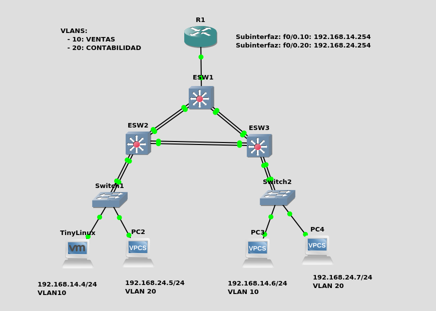
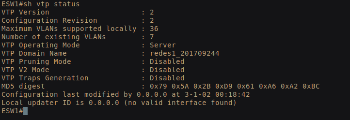
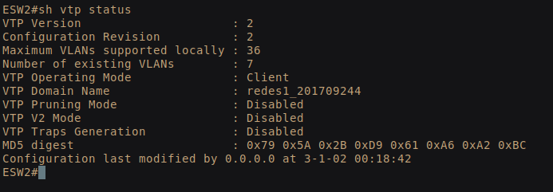
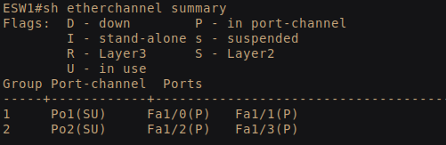
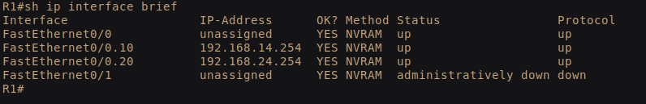

# Redes1-Practica4_201709244

## Definicion de las redes

| VLAN | Direccion de Red | Primera Direccion Asignable | Ultima Direccion Asignable | Direccion de Broadcast |
| ------------- |:-------------:|:-------------:|:-------------:|:-------------:| 
| 10 | 192.168.14.0/24 | 192.168.14.1 | 192.168.14.254 | 192.168.14.255 |
| 20 | 192.168.24.0/24 | 192.168.24.1 | 192.168.24.254 | 192.168.24.255 |

<h2>Topologia a realizar</h2>

## Configuracion

### Configuracion de VTP

 
 

### Creacion de VLANs 

 

### Configuracion de los port-channel

 

### Configuracion de las subinterfaces del Router 

 
